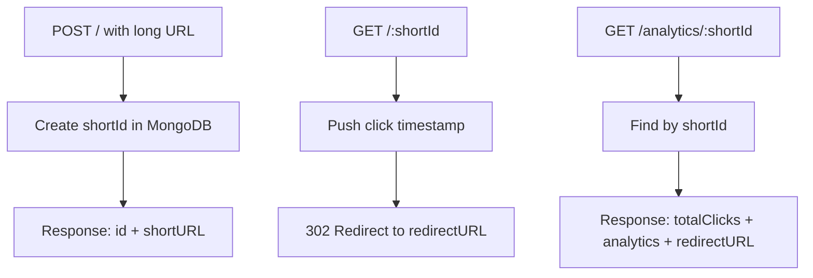

# URL Shortener

A full-stack URL shortener with click analytics.

- Frontend: React + Vite + Tailwind CSS
- Backend: Node.js + Express + MongoDB (Mongoose)
- Create short URLs from long URLs
- Redirect using short URL
- Track total clicks and click timestamps
- Analytics page with loading indicators
- Responsive UI for mobile and laptop screens

## Project Structure

```text
url-shortener/
|-- client/                  # React frontend
|-- server/                  # Express backend
`-- vercel.json              # Vercel rewrite rules
```

## How It Works

1. User submits a long URL on the home page.
2. Backend creates a `shortId` and stores mapping in MongoDB.
3. Backend returns a short URL: `BASE_URL/<shortId>`.
4. Visiting that short URL:
   - records a click timestamp
   - redirects to the original URL
5. Analytics endpoint returns click count + history for a `shortId`.

## Environment Variables

### Backend (`server/.env`)

Create `server/.env` with:

```env
PORT=5000
MONGODBURL=<your_mongodb_connection_string>
BASE_URL=http://localhost:5000
FRONTEND_URL=http://localhost:5173
```

### Frontend (`client/.env`)

Create `client/.env` with:

```env
VITE_API_BASE_URL=http://localhost:5000
```

Note: `VITE_API_BASE_URL` must include protocol (`http://` or `https://`).

## Local Development

Open two terminals.

### 1. Start backend

```bash
cd server
npm install
npm start
```

Backend runs at `http://localhost:5000` by default.

### 2. Start frontend

```bash
cd client
npm install
npm run dev
```

Frontend runs at `http://localhost:5173`.

## API Reference

Base URL: `http://localhost:5000`

### API Response Diagram



### Create short URL

- Method: `POST`
- Route: `/`
- Body:

```json
{
  "url": "https://example.com/some/very/long/path"
}
```

- Response:

```json
{
  "id": "abc123",
  "shortURL": "http://localhost:5000/abc123"
}
```

### Redirect to original URL

- Method: `GET`
- Route: `/:shortId`
- Behavior: Records click timestamp, then redirects.

### Get analytics

- Method: `GET`
- Route: `/analytics/:shortId`
- Response:

```json
{
  "totalClicks": 3,
  "analytics": [
    { "timestamp": 1736251000000 },
    { "timestamp": 1736252000000 }
  ],
  "redirectURL": "https://example.com/some/very/long/path"
}
```

## Scripts

### Backend (`server/package.json`)

- `npm start` -> run backend with nodemon

### Frontend (`client/package.json`)

- `npm run dev` -> start Vite dev server
- `npm run build` -> production build
- `npm run preview` -> preview build output
- `npm run lint` -> run ESLint

## Deployment Notes

This repo includes `vercel.json` rewrites:

- `/api/(.*)` -> `/server/index.js`
- `/(.*)` -> `/client/dist/`

Before deployment, ensure all env variables are configured on the hosting platform.

## Troubleshooting

### `AxiosError: Unsupported protocol localhost:`

Cause: API base URL missing protocol.

Fix:

- Use `VITE_API_BASE_URL=http://localhost:5000` (not `localhost:5000`)
- Restart frontend dev server after changing `.env`
